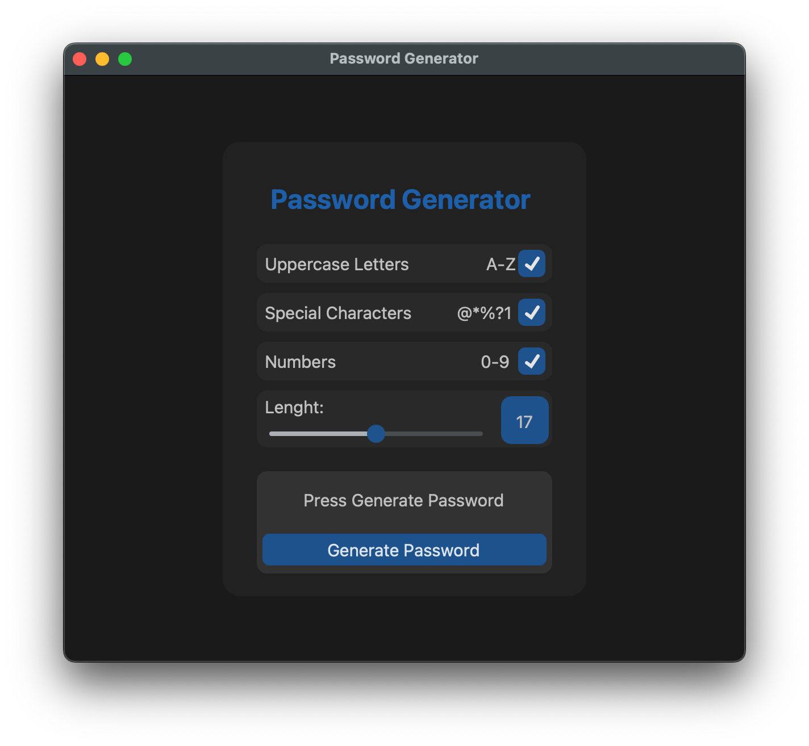

This is a simple app that let’s you generate a random password.

This is my first time coding an app and working with interfeces.
I did this project only as an exercise to learn pyhton and interface developing.

## Features 
- Simple an minimal interface
- Fully written in python
- Interfece made usinging the customtkinter python module, a simpler and more modern version of Tkinter module

